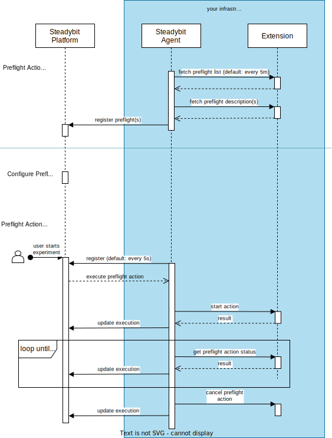

# Preflight API

This document explains the preflight API, control flow and the contracts behind it. It starts with a high-level overview and then explains every API in detail.

## Overview

Preflights are implemented with the help of PreflightKit and the preflight API through an implementation of an extension. Extensions are HTTP servers
implementing the preflight API to describe which preflight checks are supported and how to execute these. The following diagram illustrates who is issuing calls and in what
phases.



As can be seen above, the extension is called by the Steadybit agent in two phases:

- In the preflight registration phase, Steadybit learns about the supported preflight checks. Once this phase is completed, preflights will be used within Steadybit
  before the execution of experiments.
- The preflight execution phase occurs whenever an experiment is about to be executed, allowing the system to prevent execution based on predefined criteria.

The following sections explain the various API endpoints, their responsibilities and structures in more detail.

## Preflight List

As the name implies, the preflight list returns a list of supported preflight checks. Or, more specifically, HTTP endpoints that the agent should call to learn more about
the preflights.

This endpoint needs to be [registered with Steadybit agents](./preflight-registration.md).

### Example

```json
// Request: GET /preflights

// Response: 200
{
  "preflights": [
    {
      "method": "GET",
      "path": "/preflights/maintenance-window"
    }
  ]
}
```

### References

- [Go API](https://github.com/steadybit/preflight-kit/tree/main/go/preflight_kit_api): `PreflightListResponse`
- [OpenAPI Schema](https://github.com/steadybit/preflight-kit/tree/main/openapi): `PreflightList`

## Preflight Description

A preflight description is required for each preflight check. The HTTP endpoint serving the description is discovered through the preflight list endpoint.

Preflight descriptions expose information about the presentation, configuration and behavior of preflight checks. For example:

- What should the preflight check be called?
- What kind of experiment information is needed to make a preflight decision?

### Example

```json
// Request: GET /preflights/maintenance-window

// Response: 200
{
  "id": "com.steadybit.example.preflights.maintenance-window",
  "label": "Maintenance Window Check",
  "description": "Checks if the experiment execution time is within the allowed maintenance window",
  "version": "1.0.0",
  "icon": "data:image/svg+xml;base64,PHN2ZyB3aWR0aD0iMjQiIGhlaWdodD0iMjQiIHZpZXdCb3g9IjAgMCAyNCAyNCIgZmlsbD0ibm9uZSIgeG1sbnM9Imh0dHA6Ly93d3cudzMub3JnLzIwMDAvc3ZnIj4KPHBhdGggZD0iTTEyIDIxQzE2Ljk3MDYgMjEgMjEgMTYuOTcwNiAyMSAxMkMyMSA3LjAyOTQ0IDE2Ljk3MDYgMyAxMiAzQzcuMDI5NDQgMyAzIDcuMDI5NDQgMyAxMkMzIDE2Ljk3MDYgNy4wMjk0NCAyMSAxMiAyMVoiIHN0cm9rZT0iIzE4MTgxOCIgc3Ryb2tlLXdpZHRoPSIyIiBzdHJva2UtbGluZWNhcD0icm91bmQiIHN0cm9rZS1saW5lam9pbj0icm91bmQiLz4KPHBhdGggZD0iTTEyIDYuNzVWMTJINi43NjgwMSIgc3Ryb2tlPSIjMTgxODE4IiBzdHJva2Utd2lkdGg9IjIiIHN0cm9rZS1saW5lY2FwPSJyb3VuZCIgc3Ryb2tlLWxpbmVqb2luPSJyb3VuZCIvPgo8L3N2Zz4K",
  "targetAttributeIncludes": ["host.hostname", "k8s.deployment"],
  "start": {
    "method": "POST",
    "path": "/preflights/maintenance-window/start"
  },
  "status": {
    "method": "POST",
    "path": "/preflights/maintenance-window/status",
    "callInterval": "5s"
  },
  "cancel": {
    "method": "POST",
    "path": "/preflights/maintenance-window/cancel"
  }
}
```

### References

- [Go API](https://github.com/steadybit/preflight-kit/tree/main/go/preflight_kit_api): `DescribePreflightResponse`
- [OpenAPI Schema](https://github.com/steadybit/preflight-kit/tree/main/openapi): `DescribePreflightResponse`

### Versioning

Preflights are versioned strictly, and Steadybit will ignore definition changes for the same version. Remember to update the version every time you update the
preflight description.

## Preflight Execution

Preflight execution is divided into three phases:

- start
- status
- cancel

HTTP endpoints represent each phase. Steadybit learns about these endpoints through the preflight description documented in the previous sections. The following sub-sections explain the responsibilities of each of the endpoints in detail.

### Start

The start phase initiates the preflight check process. This is where the initial validation of configuration parameters and the experiment setup can take place. This endpoint must respond within a few seconds. For longer-running validations, the actual check work should be done in the status phase.

#### Example

```json
// Request: POST /preflights/maintenance-window/start
{
  "preflightActionExecutionId": "3fa85f64-5717-4562-b3fc-2c963f66afa6",
  "experimentExecution": {
    "id": "4ba85f64-5717-4562-b3fc-2c963f66afa7",
    "name": "Check API Resilience",
    "description": "This experiment tests the resilience of our API",
    "hypothesis": "The API should remain available even when a service is down",
    "steps": {
      ...
    }
  }
}

// Response: 200 (success)
{
}

// Response: 200 (failure)
{
  "error": {
    "title": "Preflight start failure",
    "status": "failed"
  }
}
```

### Status

The status phase checks the current status of the preflight check. This is where the main validation logic occurs. For long-running checks (such as integrations with external approval systems), this endpoint will be called repeatedly until it returns `completed: true`. Steadybit calls this endpoint at the interval specified in the preflight description.

#### Example

```json
// Request: POST /preflights/maintenance-window/status
{
  "preflightActionExecutionId": "3fa85f64-5717-4562-b3fc-2c963f66afa6"
}

// Response: 200 (not yet completed)
{
  "completed": false
}

// Response: 200 (completed successfully)
{
  "completed": true
}

// Response: 200 (completed with failure)
{
  "completed": true,
  "error": {
    "title": "Outside maintenance window",
    "detail": "Experiment is scheduled outside the allowed maintenance window (8 PM to 6 AM UTC)",
    "status": "failed"
  }
}
```

### Cancel

The cancel phase allows for cleanup of any resources associated with a preflight check. This is particularly important for long-running checks that might maintain state or connect to external systems.

#### Example

```json
// Request: POST /preflights/maintenance-window/cancel
{
  "preflightActionExecutionId": "3fa85f64-5717-4562-b3fc-2c963f66afa6"
}

// Response: 200
{
}
```

### References

- [Go API](https://github.com/steadybit/preflight-kit/tree/main/go/preflight_kit_api): `StartPreflightRequestBody`, `StartResult`, `StatusPreflightRequestBody`, `StatusResult`, `CancelPreflightRequestBody`, `CancelResult`
- [OpenAPI Schema](https://github.com/steadybit/preflight-kit/tree/main/openapi): Corresponding schema objects

### Error handling

The preflight endpoints follow the same mechanisms for error handling as other Steadybit extension APIs.

The agent will stop the experiment execution if the extension:

- Returns a HTTP status code which is not `200`
- Returns a body with an `error` property containing a `PreflightKitError`
- Returns a `StatusResult` with `completed: true` and an `error` property containing a `PreflightKitError`

The `status` field in a `PreflightKitError` defines how Steadybit will display the error:

- `failed` - The preflight has detected a condition that should prevent the experiment from running, such as being outside a maintenance window
- `errored` - There was a technical error while executing the preflight check

#### References

- [Go API](https://github.com/steadybit/preflight-kit/tree/main/go/preflight_kit_api): `PreflightKitError`
- [OpenAPI Schema](https://github.com/steadybit/preflight-kit/tree/main/openapi): `PreflightKitError`
